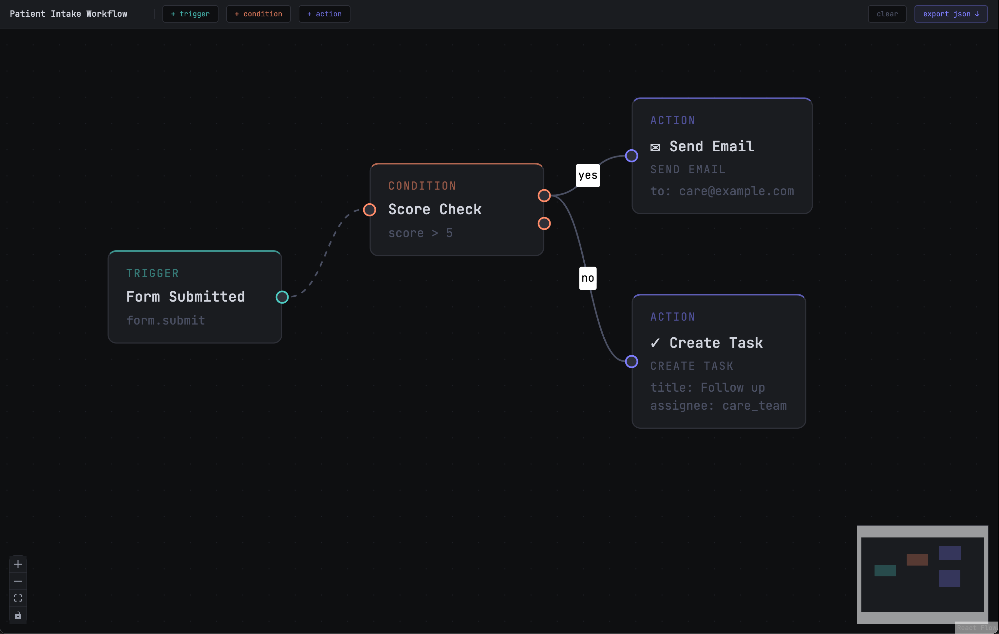

# flowbuilder

A visual automation workflow builder. Configure trigger → condition → action pipelines on a drag-and-drop canvas and export them as a typed JSON schema.



## stack

- **Vite** — build tooling
- **React 18 + TypeScript** — UI
- **@xyflow/react** — canvas and graph engine
- **Zustand** — lightweight state management
- **Tailwind CSS** — styling
- **Vitest** — unit tests
- **ESLint (airbnb) + Prettier** — linting and formatting

## getting started

```bash
pnpm install
pnpm dev
```

open http://localhost:5173

## scripts

```bash
pnpm dev          # start dev server
pnpm build        # production build
pnpm test         # run tests
pnpm typecheck    # tsc --noEmit
pnpm lint         # eslint
pnpm lint:fix     # eslint --fix
```

## how it works

A workflow describes automated logic that runs when something happens in the system. Three node types make up a workflow:

- **trigger** — the entry point. Defines what event kicks off the workflow (e.g. `form.submit`, `assessment.complete`)
- **condition** — a branch. Evaluates a field against a value and routes to different paths (e.g. `score > 5`)
- **action** — the result. Something the system does (send an email, create a task, fire a webhook)

Connect nodes by dragging from an output handle to an input handle. Click any node to edit its fields in the side panel. Hit `Backspace` to delete a selected node or edge.

## export format

Clicking **export json** downloads a workflow config that a backend could consume to execute the automation logic:

```json
{
  "id": "uuid",
  "name": "Patient Intake Workflow",
  "exportedAt": "2026-01-01T00:00:00.000Z",
  "nodes": [
    {
      "id": "trigger-1",
      "kind": "trigger",
      "data": { "kind": "trigger", "label": "Form Submitted", "event": "form.submit" }
    },
    {
      "id": "condition-1",
      "kind": "condition",
      "data": { "kind": "condition", "label": "Score Check", "field": "score", "operator": ">", "value": "5" }
    },
    {
      "id": "action-1",
      "kind": "action",
      "data": {
        "kind": "action",
        "label": "Send Email",
        "actionType": "send_email",
        "config": { "to": "care@example.com" }
      }
    }
  ],
  "edges": [
    { "id": "e1", "from": "trigger-1", "to": "condition-1" },
    { "id": "e2", "from": "condition-1", "to": "action-1" }
  ]
}
```

The `kind` field on each node acts as a discriminant — a backend switches on it to know which fields are present and how to execute the node.

## project structure

    src/
      components/
        nodes/              # TriggerNode, ConditionNode, ActionNode
        ui/                 # Toolbar, EditPanel
      store/
        workflowStore.ts    # Zustand store — nodes, edges, export
      types/
        index.ts            # discriminated union types for node data
      __tests__/
        workflowStore.test.ts

## design decisions

**Zustand over Redux** — no boilerplate, store is accessible outside React which makes export logic and testing straightforward, and the API is simple enough to explain quickly.

**`FlowNode = Node<Record<string, unknown>>` at the store layer** — React Flow's internal generics require `Record<string, unknown>`. Rather than fighting that constraint with index signatures that widen the discriminated union, we let React Flow own its type internally and assert our typed `WorkflowNodeData` at the component and export boundaries.

**discriminated union on `kind`** — makes the export schema self-describing and gives a backend a clean switch target without needing to inspect arbitrary fields.
